# Examples

Here are examples of recordings made by TermCap and rendered with various SVG templates.

## TermCap command line session (window_frame_js template)

    

## Color support (progress_bar template)

    

## htop (gjm8 template)

    

## IPython session (window_frame template)

    

## Python unittest session (solarized_dark template)

    

